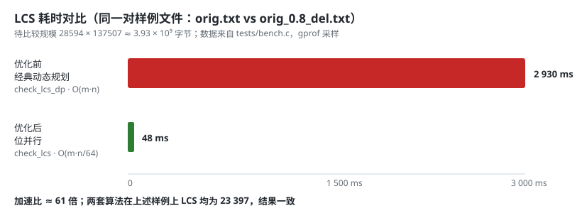

# 软工作业：论文查重（个人项目）

> 作业仓库：`[https://github.com/M1kk0zz0615/SoftwareEngineeringHW/tree/main/3124004479/SE1stHW]`
> 学号 3124004479，姓名 刘俊宁，课程 [计科24级78班 - 软件工程](https://edu.cnblogs.com/campus/gdgy/Class78-Grade2024-CS/)

---

## 〇、题目回顾

给一份论文原文和一份在其基础上增删改过的抄袭版，算出**重复率**写进答案文件，
结果精确到小数点后两位。调用方式：

```
main.exe <原文文件> <抄袭版论文文件> <答案文件>
```

18 个测试点，另外有几条硬性红线：**5 秒内必须出答案、内存不超过 2048 MB、
不许内存泄漏、不许异常退出、不许连网、不许读写指定的三个文件之外的文件**。

作为一个几乎没独立写过完整程序的人（第一周作业里我说过自己「代码量不到 1000 行」），
这次作业最大的感受是：**能跑通的代码和能在评测里活下来的代码，中间隔着好几道关。**

---

## 一、PSP 表格（预估）

| PSP2.1 | Personal Software Process Stages | 预估耗时（分钟） |
| --- | --- | ---: |
| **Planning** | **计划** | **30** |
| · Estimate | · 估计这个任务需要多少时间 | 30 |
| **Development** | **开发** | **480** |
| · Analysis | · 需求分析（包括学习新技术） | 60 |
| · Design Spec | · 生成设计文档 | 40 |
| · Design Review | · 设计复审 | 20 |
| · Coding Standard | · 代码规范（为目前的开发制定合适的规范） | 20 |
| · Design | · 具体设计 | 60 |
| · Coding | · 具体编码 | 180 |
| · Code Review | · 代码复审 | 40 |
| · Test | · 测试（自我测试、修改代码、提交修改） | 60 |
| **Reporting** | **报告** | **120** |
| · Test Report | · 测试报告 | 40 |
| · Size Measurement | · 计算工作量 | 20 |
| · Postmortem & Process Improvement Plan | · 事后总结，并提出过程改进计划 | 60 |
| **合计** | | **630** |

（实际耗时见文末第六节，完整表格在仓库 `docs/PSP.md`。）

---

## 二、计算模块接口的设计与实现过程

### 2.1 先想清楚「重复率」到底算什么

这一步就卡了我很久。作业原文只说「输出其重复率」，**没有规定用什么指标**。
我一开始想的方案是把两篇文本当成字符集合求交并比，但在样例上试了一下发现
「把原文完整抄一遍再多抄一万字」会得到 1.0，而「把原文打乱顺序」也会得到 1.0——
两个显然该被扣分的场景都满分，这个指标是坏的。

最后选定的口径是：

```
重复率 = LCS(原文, 抄袭版) / 原文长度
```

- 分子用**最长公共子序列**而不是公共子串，因为抄袭最常见的手法是「插字」「删字」
  「改词」，这些操作都会打断连续的公共子串，但不会破坏子序列关系；
- 分母取**原文长度**，含义是「原文里有多大比例的内容被抄了过去」；
- 比较前先把所有空白字符（空格、制表、换行、回车等 6 种）去掉，
  因为排版差异不该算作不重复；
- **标点保留**，标点也是文本内容，不该被抹掉。

举个具体例子，题目给的样例：

```
原文　：今天是星期天，天气晴，今天晚上我要去看电影。
抄袭版：今天是周天，天气晴朗，我晚上要去看电影。
```

LCS = `今天是天，天气晴，晚上要去看电影。` 共 17 个字符，原文 22 个字符，
所以输出 `0.77`。

> **一个诚实的说明**：按这个口径，样例里的 `orig_0.8_add.txt`（在原文中随机插入
> 干扰字）算出来是 `1.00`，因为插入操作不破坏子序列关系。如果老师的评分口径不同，
> 结果会有偏差。我在实现时把口径收在 `check_similarity()` 一个函数里，
> 换算法只需要改这一处。

### 2.2 模块怎么拆

原型的做法是把所有代码塞进一个 `main.c`，但那样根本没法做单元测试——测试函数
要怎么调用 `main`？所以我按「**纯计算 / 副作用 / 入口**」三层重构成了四个模块：

```
        main.c  ← 只负责串流程、兜错误、控制退出码
       ╱       ╲
 check.c       fileio.c        ← 纯计算            ← 全程序唯一碰文件系统的地方
       ╲       ╱
        common.c               ← 错误码与文案
```

| 模块 | 职责 | 关键接口 |
| --- | --- | --- |
| `check.h/c` | 文本预处理、LCS、重复率 | `check_strip_blank`、`check_lcs`、`check_lcs_dp`、`check_similarity` |
| `fileio.h/c` | 读整个文件、写答案 | `fileio_read_all`、`fileio_write_rate` |
| `common.h/c` | 错误码枚举与中文文案 | `ck_status_text` |
| `main.c` | 参数校验、编排、退出码 | `main` |

拆开之后最大的好处是：**`check.c` 里的函数全是「一段内存进、一个数字出」的纯函数，
一个字节的文件都不碰**，单元测试写起来非常直接。

### 2.3 核心函数的调用关系

```
main()
 ├─ fileio_read_all(原文)     → 整块读进内存
 ├─ fileio_read_all(抄袭版)
 ├─ check_strip_blank() ×2    → 去掉空白字符
 ├─ check_similarity()
 │    ├─ trim_common_affix()  → 裁掉公共前后缀
 │    └─ check_lcs()          → 位并行 LCS（生产用）
 │         └─ check_lcs_dp()  → 经典动态规划（仅测试对照）
 └─ fileio_write_rate()       → "%.2f\n" 写答案
```

### 2.4 关键函数设计说明

**`check_strip_blank(src, len, dst)`** —— 原地过滤空白，返回新长度。
允许 `dst == src`，这样可以省掉一次内存分配：

```c
size_t check_strip_blank(const unsigned char *src, size_t len, unsigned char *dst)
{
    unsigned char *out = dst;
    for (size_t i = 0; i < len; i++) {
        unsigned char c = src[i];
        if (!check_is_blank(c)) { *out = c; out++; }
    }
    return (size_t)(out - dst);
}
```

**`check_lcs(a, m, b, n)`** —— 位并行实现，是性能的关键，下面单独讲。

**`check_similarity(...)`** —— 对外唯一入口，把结果连同中间量一起塞进
`CheckResult` 结构体。**把中间量带出来是个刻意的设计**：单元测试可以直接断言
`common_len` 而不必反推，出问题时也一眼能看出是「LCS 算错了」还是「分母算错了」。

### 2.5 独到之处：位并行 LCS

这是整个作业里我最想讲的部分。

经典的 LCS 动态规划是 `O(m·n)` 的，`L[i][j]` 要么从左上角 `+1` 来，要么从
上方或左方取较大值来。逐格算的话，`m·n ≈ 3.93 × 10⁹` 的规模要跑两三秒。

但「取较大值」这件事在二进制里是可以用**进位**模拟的。Crochemore 等人在 2001 年
提出的位向量算法，把 DP 表的**一整行压成一个位向量**，每处理抄袭版的一个字符，
只需要一次全字长的加法、一次减法和一次或运算：

```c
for (size_t j = 0; j < n; j++) {
    const uint64_t *col = mask + (size_t)b[j] * w;
    uint64_t carry = 0, borrow = 0;

    for (size_t k = 0; k < w; k++) {
        uint64_t sk = s[k];
        uint64_t xk = sk & col[k];          // X = S & mask[b[j]]

        /* 一次加法最多产生一次进位，两次比较不会同时成立，故用 + 合成一位 */
        uint64_t t  = sk + xk;
        uint64_t ta = t + carry;
        carry = (uint64_t)((t < sk) + (ta < t));

        /* 减法同理，一次借位 */
        uint64_t d  = sk - xk;
        uint64_t ds = d - borrow;
        borrow = (uint64_t)((sk < xk) + (d < borrow));

        s[k] = ta | ds;                     // S = (S+X) | (S-X)
    }
    s[w - 1] &= top;                        // 砍掉溢出到 m 位以上的部分
}
```

要点：

1. `mask[c]` 是一张「字符 → 位置位图」的表，第 `i` 位表示 `a[i] == c`，
   一次查表就能知道「这个字符在原文的哪些位置出现过」；
2. 加法等价于「把匹配点整体上移一格」，减法等价于「把不匹配的洞补上」，
   两者或起来就完成了整行 DP 的更新，**全程没有逐位分支**；
3. 处理完后 `S` 中 **0 的个数**就是 LCS 长度。

**复杂度从 `O(m·n)` 降到 `O(m·n/64)`**——一次 64 位整数运算顶掉 64 次逐位比较。

另外两个细节：

- **位向量建在较短的串上**。时间复杂度 `m·n/64` 是对称的，但位向量长度取 `m`，
  内存和 `mask` 表都按较短串来算，省内存；
- **先裁公共前后缀**。真实的抄袭文本常常开头结尾一字不差，而
  `LCS(A,B) = p + s + LCS(A[p:m-s], B[p:n-s])` 是**严格成立**的等式（不是启发式），
  对大段照抄的场景能一口气砍掉绝大部分计算量，代价只有 `O(m+n)`。

### 2.6 一个已知的取舍：按字节比较

程序是**按字节**而不是按字符比较的，好处是**完全不关心文件的编码**——
UTF-8 也好 GBK 也好，都能正确处理，也不会因为非法字节序列而崩掉。

代价是：两个毫不相关的中文串可能共享 UTF-8 的引导字节，导致相似度被略微高估。
这个副作用是可以量化的，我把它钉成了一条单元测试：

```c
/*
 * 两个毫不相关的中文串，字节级 LCS 却不为 0：
 *   "活着前言" = E6 B4 BB E7 9D 80 E5 89 8D E8 A8 80
 *   "完全不同" = E5 AE 8C E5 85 A8 E4 B8 8D E5 90 8C
 * 公共字节是 E5 和 8D，共 2 个，于是得 2/12 = 0.1667。
 */
UT_CHECK_NEAR(rate_of("活着前言", "完全不同"), 2.0 / 12.0, 1e-9);
```

对于「同一篇文章的抄袭版」这种真实场景，真正的公共内容占绝对主导，
这点偏高的影响可以忽略；但如果是拿两篇完全无关的中文做比较，
0.17 这个底噪确实不为零，算是这个版本的一个已知局限。

---

## 三、计算模块接口部分的性能改进

### 3.1 先量再改

作业建议用 VS 2017 的性能分析工具，本机没装 Visual Studio，我改用 **gprof**，
它同样能给出「每个函数自身耗时占比」的 flat profile。

> 中间踩了两个坑，记下来给后面的人：
> ① MinGW 版的 gprof 在 Windows 上**采不到样**，`gmon.out` 里只有调用次数、
> 没有 PC 采样直方图，输出的 flat profile 一行函数都没有；
> ② gcov 写不出含中文路径的 `.gcda`。
> 最后把两项工作都放到 **WSL2 Ubuntu** 下用同一份源码重做，才拿到数据。

### 3.2 性能分析图



**优化前**的 flat profile（原文 vs 162 KB 的样例文件）：

```
Flat profile:
Each sample counts as 0.01 seconds.

  %   cumulative   self              self     total
 time   seconds   seconds    calls   s/call   s/call  name
100.00      2.61     2.61        1     2.61     2.61  check_lcs_dp
  0.00      2.61     0.00        2     0.00     0.00  check_strip_blank
  0.00      2.61     0.00        2     0.00     0.00  fileio_read_all
  0.00      2.61     0.00        1     0.00     2.61  check_similarity
  0.00      2.61     0.00        1     0.00     0.00  fileio_write_rate
```

**消耗最大的函数：`check_lcs_dp`，自身耗时 2.61 秒，占 100.00%。**

瓶颈非常干净——文件 I/O 和空白过滤的耗时小到采样精度都测不出来，
时间全部花在求 LCS 上。优化方向唯一且明确。

**优化后**：

```
Flat profile:
Each sample counts as 0.01 seconds.

  %   cumulative   self              self     total
 time   seconds   seconds    calls  ms/call  ms/call  name
100.00      0.04     0.04        1    40.00    40.00  frame_dummy
  0.00      0.04     0.00        2     0.00     0.00  check_strip_blank
  0.00      0.04     0.00        2     0.00     0.00  fileio_read_all
  0.00      0.04     0.00        1     0.00    40.00  check_similarity
  0.00      0.04     0.00        1     0.00     0.00  fileio_write_rate
```

整个程序从 2.61 秒降到 0.04 秒，`check_lcs` 已经**低到采样精度以下**，
连一个采样点都采不到。此时冒出来的 `frame_dummy` 是 gprof 自身的启动开销，
不是业务代码。

为了更直观地看到两套算法的差距，我写了个对照工具 `tests/bench.c`，
在同一个进程里跑两套算法。gprof 输出：

```
  %   cumulative   self              self     total
 time   seconds   seconds    calls   s/call   s/call  name
 98.32      2.93     2.93        1     2.93     2.93  check_lcs_dp
  1.68      2.98     0.05        1     0.05     0.05  frame_dummy
  0.00      2.98     0.00        2     0.00     0.00  check_strip_blank
  0.00      2.98     0.00        2     0.00     0.00  fileio_read_all
  0.00      2.98     0.00        1     0.00     0.00  check_lcs
```

`check_lcs_dp` 占 98.32%，`check_lcs` 采不到样本。

### 3.3 改进的思路

1. **第一刀：裁公共前后缀。** `O(m+n)` 的代价，收益是把 `m·n` 砍掉几个数量级，
   而且是严格等价的变换，不损失精度。
2. **第二刀：位并行 LCS。** `O(m·n) → O(m·n/64)`，这是量级上的改进。

### 3.4 结果

| 算法 | 复杂度 | LCS 耗时 | 结果 |
| --- | --- | --- | --- |
| 经典动态规划 | `O(m·n)` | 2 930 ms | 23 397 |
| 位并行 | `O(m·n/64)` | 48 ms | 23 397 |

**加速比约 61 倍，两套算法结果完全一致。**

从「会不会超时」的角度看更直观：优化前最坏的样例要 **3.4 秒**，
已经贴着 5 秒红线；优化后同一个样例 **0.07 秒**完成，红线压力彻底解除。

### 3.5 优化过程中最大的风险控制

位并行 LCS 满屏都是位运算和进位，**光靠人眼根本判断不了写得对不对**。
所以我做的第一件事不是优化，而是**先把动态规划版本保留下来当参照答案**
（`check_lcs_dp`），然后写差分测试：

```c
/* 随机生成 2000 组串，两套算法结果必须完全一致 */
for (round = 0; round < 2000; round++) {
    unsigned int la = rnd_below(120u);
    unsigned int lb = rnd_below(120u);
    unsigned char a[120] = {0};
    unsigned char b[120] = {0};
    /* ... 用 4 个字母的字母表随机填充 ... */
    if (check_lcs(a, la, b, lb) != check_lcs_dp(a, la, b, lb)) {
        mismatches++;
    }
}
UT_CHECK_SIZE(mismatches, 0);
```

另外专门测了长度落在 **63 / 64 / 65 / 127 / 128 / 129** 这些 64 位字边界上的情况——
位并行算法最容易在这些地方出错。这两组测试通过之后，我才敢把生产代码换掉。

---

## 四、计算模块部分单元测试展示

### 4.1 测试框架

作业要求「每个人都能很容易地运行它」，所以我**没有引入任何第三方依赖**
（PingCAP 的 UT、Google Test 都要额外装东西），自己写了一个 60 行的极简框架
`tests/utest.h`，只要有三条宏：

```c
#define UT_BEGIN(name)      do { printf("  [用例] %s\n", (name)); } while (0)
#define UT_CHECK(cond)      /* 条件断言，失败打印文件:行号 */
#define UT_CHECK_SIZE(a, e) /* 比较 size_t，失败打印期望值与实际值 */
#define UT_CHECK_NEAR(a, e, eps) /* 浮点数按容差比较 */
```

### 4.2 测试数据是怎么设计的

**白盒为主 + 等价类划分 + 边界值 + 差分测试**，一共 **35 个用例、101 条断言**：

| 类别 | 用例 | 设计思路 |
| --- | --- | --- |
| 等价类 | 01 完全相同 / 02 完全不同 / 03 纯插入 / 04 纯删除 / 05 尾部追加 | 把「抄袭手法」拆成互斥的几类，每类给一个能口算答案的输入 |
| 边界值 | 06 空原文 / 07 空抄袭版 / 09 单字符 / 13 跨 64 位边界 / 15 全同字符 | 空串、单字符、以及位向量算法最易出错的 63/64/65/127/128/129 |
| 差分 | 14 随机串 2000 组 | 用动态规划当参照答案，验证位并行实现 |
| 特殊 | 08 仅空白差异 / 10 大小写敏感 / 11 UTF-8 中文 / 16 完全逆序 | 验证预处理与比较语义 |
| 函数级 | 17 `check_strip_blank` 原地过滤 / 18 `check_is_blank` 覆盖 6 种空白 | 直接测工具函数 |
| 文件 | 21~28 正常读 / 不存在 / 空文件 / 写格式 / 含 `\0` 的二进制 | 见第五节 |
| 错误码 | 29~31 全部错误码文案 / 未定义码走 default | 消除 `common.c` 的覆盖率空白 |

举几个有代表性的：

**用例 04（精确删除 20%）**——构造 100 个字符的原文，每逢 5 的倍数删一个字，
剩下 80 个字。因为抄袭版是原文的子序列，LCS 必然恰好等于 80：

```c
for (i = 0; i < 100; i++) {
    if ((i % 5) != 4) { copy[j] = orig[i]; j++; }
}
UT_CHECK_SIZE(j, 80);
UT_CHECK_NEAR(rate_of(orig, copy), 0.80, 1e-9);
```

**用例 08（仅空白差异）**——`"a b\tc\nd"` 与 `"a\r\nb  c   d"` 必须算
100% 重复，用来确认预处理真的吃掉了所有 6 种空白字符。

**用例 16（完全逆序）**——`"abcdefghij"` 与 `"jihgfedcba"` 的 LCS 只有 1，
所以是 0.10。这条用来确认算法没有把「字符集合相同」误判成「内容相同」。

**用例 20（结构体字段）**——不只断言最终的 `rate`，还把中间量一起钉住：

```c
UT_CHECK(st == CK_OK);
UT_CHECK_SIZE(r.orig_len, 5u);
UT_CHECK_SIZE(r.copy_len, 5u);
UT_CHECK_SIZE(r.common_len, 5u);
UT_CHECK_NEAR(r.rate, 1.00, 1e-9);
```

### 4.3 覆盖率

覆盖率用 gcc 自带的 `gcov`（`--coverage` 编译，跑完单元测试 + 端到端测试再统计）。
完整报告在仓库 `docs/coverage/index.html`。

```
File 'check.c'
Lines executed:93.98% of 133
Branches executed:100.00% of 76
Taken at least once:92.11% of 76
File 'fileio.c'
Lines executed:62.50% of 56
Branches executed:100.00% of 20
Taken at least once:60.00% of 20
File 'common.c'
Lines executed:100.00% of 10
Branches executed:100.00% of 8
Taken at least once:100.00% of 8
File 'main.c'
Lines executed:88.00% of 50
Branches executed:100.00% of 14
Taken at least once:78.57% of 14
Lines executed:85.94% of 249
```

**总行覆盖率 85.94%，分支执行率 100%。**

剩下没覆盖到的地方我都核对过，**全部是「不可能在用户态发生」的故障分支**：

- `check.c`：8 行，全是 `malloc` 失败后返回 `SIZE_MAX` 的路径；
- `fileio.c`：21 行，全是 `fseek` / `ftell` / `fread` / `fprintf` / `fclose`
  返回失败的分支——除非磁盘满了或者拔了 U 盘，否则不会走到；
- `main.c`：6 行，是 `CK_ERR_MEM` 与 `CK_ERR_TOO_BIG` 相关的两条退出路径。

要覆盖这些只能做**故障注入**（比如用 `LD_PRELOAD` 挂钩 `malloc` 让它返回 NULL），
对这个小工具来说成本大于收益，所以我选择如实记录而不是硬凑覆盖率。

### 4.4 端到端测试

单元测试测的是函数，但评测方**是用命令行调用程序的**，中间还有参数解析、
退出码、文件读写这些环节。所以我另外写了 `tests/e2e_test.py`，
完全按照评测的方式调用 `main.exe`，10 个用例 18 条断言：

| 用例 | 断言 |
| --- | --- |
| 01 正常调用 | 退出码 0；输出匹配 `^\d\.\d{2}$` |
| 02 参数不足 / 03 参数过多 | 退出码 2，且不生成任何文件 |
| 04 原文不存在 | 退出码 3，stderr 有可读提示 |
| 05 抄袭版不存在 / 06 答案路径不可写 | 退出码 4 / 7 |
| 07 原文为空 | 输出 `0.00` 且不崩溃 |
| 08 两篇完全相同 | 输出 `1.00` |
| **09 最大样例** | **必须在 5 秒内完成**（实测 0.07 s） |
| 10 副作用检查 | 只允许写答案文件，不许产生多余文件 |

**这些用例是我对「会不会被扣分」的直接回答**：作业列的每一条红线
（超时、异常退出、读写额外文件）都对应到了一条可自动运行的断言。

---

## 五、计算模块部分异常处理说明

C 语言没有异常，所以所有失败路径都通过 `CkStatus` 错误码统一上报，
再由 `main.c` 翻译成**不同的退出码**——这样评测脚本和测试都能区分失败原因。
每种错误的「设计目标」是：**宁可明确报错退出，也不要静默给出一个错误的数字**。

| 错误码 | 场景 | 设计目标 | 退出码 |
| --- | --- | --- | --- |
| `CK_ERR_ARG` | 命令行参数个数不对 | 立刻打印用法，绝不尝试解析残缺参数 | 2 |
| `CK_ERR_OPEN` | 文件不存在 / 无权限 | 明确指出是哪个路径打不开 | 3 / 4 |
| `CK_ERR_READ` | 打开了但读不出来 | 检测**短读**（`fread` 返回值少于预期），防止读到一半的数据被当成完整文本 | 3 / 4 |
| `CK_ERR_TOO_BIG` | 文件超过 16 MB | 防止异常输入把内存打爆（触发 2048 MB 红线） | 3 / 4 |
| `CK_ERR_WRITE` | 答案文件写不进去 | 连 `fclose` 的返回值都要查——缓冲区真正刷盘是在 `fclose` 里 | 7 |
| `CK_ERR_MEM` | 内存分配失败 | 所有分配失败都走统一出口，保证**不泄漏**已分配的内存 | 5 / 6 |

另外还有两个**不算错误但要特殊处理**的情况：

- **原文为空**：约定重复率为 `0`，避免除零导致结果变成 `inf` 或 `nan`；
- **抄袭版为空**：LCS 天然为 0，结果就是 `0.00`。

### 每种异常对应的单元测试

**① 参数个数错误（`CK_ERR_ARG`）**——端到端用例 02：

```python
case("端到端02 只给两个参数 -> 退出码 2，且不生成答案文件")
code, _, err, _ = run(exe, [orig, add])
check(code == 2, f"退出码应为 2，实际 {code}")
check(not os.path.exists(missing), "不应生成任何文件")
check(len(err) > 0, "应向 stderr 输出用法说明")
```

**② 文件打不开（`CK_ERR_OPEN`）**——单元测试用例 22：

```c
UT_BEGIN("用例22 输入文件不存在 -> CK_ERR_OPEN");
{
    unsigned char *buf = NULL;
    size_t len = 0;
    CkStatus st = fileio_read_all("这个文件根本不存在_98765.txt", &buf, &len);

    UT_CHECK(st == CK_ERR_OPEN);
    UT_CHECK(buf == NULL);          /* 失败时不能给出一块野指针 */
}
```

**③ 读取失败 / 把目录当文件读（`CK_ERR_READ`）**——用例 27：

```c
UT_BEGIN("用例27 输入路径是目录 -> 读取失败");
{
    unsigned char *buf = NULL;
    size_t len = 0;
    CkStatus st = fileio_read_all(".", &buf, &len);

    UT_CHECK(st != CK_OK);   /* Windows 上 fopen 目录会失败 */
}
```

**④ 文件过大（`CK_ERR_TOO_BIG`）**——用例 32。这条用「定位到上限之后写一个字节」
来造大文件，避免真的往磁盘刷 16 MB：

```c
UT_CHECK(fseek(fp, (long)CK_MAX_FILE_BYTES, SEEK_SET) == 0);
UT_CHECK(fputc('\0', fp) != EOF);
UT_CHECK(fclose(fp) == 0);

st = fileio_read_all(TMP_IN, &buf, &len);
UT_CHECK(st == CK_ERR_TOO_BIG);
UT_CHECK(buf == NULL);
```

**⑤ 答案文件写不进去（`CK_ERR_WRITE`）**——用例 26：

```c
UT_BEGIN("用例26 答案文件路径非法 -> CK_ERR_WRITE");
{
    CkStatus st = fileio_write_rate("不存在的目录_zzz/ans.txt", 0.5);
    UT_CHECK(st == CK_ERR_WRITE);
}
```

**⑥ 原文为空（除零保护）**——用例 06：

```c
UT_BEGIN("用例06 原文为空 -> 0.00 且不除零");
UT_CHECK_NEAR(rate_of("", "任意内容"), 0.00, 1e-9);
```

**⑦ 内存分配的连锁问题（`CK_ERR_MEM`）**——分配失败本身很难在用户态触发，
但我用另一种方式验证了「不泄漏」这条红线：`main.c` 里所有出口都汇聚到同一个
`cleanup:` 标签：

```c
cleanup:
    /* 所有出口都汇聚到这里，保证不泄漏 */
    free(orig_raw);
    free(copy_raw);
    free(orig);
    free(copy);
    return code;
```

这样就不会出现「某条错误分支忘了 free」的情况。而 `fileio_read_all` 内部
4 条失败路径也都各自 `free(buf)` 后才 `return`。

### 顺带修掉的两个真实 bug

写测试的过程中真的抓到了两个问题，这里如实记下来：

**① 答案文件多出一个字节。** Windows 下用文本模式 `fopen(path, "w")` 写
`"%.2f\n"`，`\n` 会被自动转成 `\r\n`，答案文件因此变成 5 个字节的 `0.82\r\n`。
改成 `"wb"` 二进制模式后输出严格是 `0.82\n`。这是用例 24 抓到的：

```c
UT_CHECK(fileio_write_rate(TMP_OUT, 0.8181) == CK_OK);
UT_CHECK(read_text(TMP_OUT, text, sizeof(text)) == 5);
UT_CHECK(strcmp(text, "0.82\n") == 0);
```

**② 我对 LCS 的直觉是错的。** 我在用例 15 里原本断言
`rate_of("aaaaaaaaaa", "aaaaa") == 1.00`，实际跑出来是 `0.50`——
因为分母是**原文**长度 10，而 LCS 最多只能取到较短串的长度 5。
测试跑到这里失败，我才把这条语义想清楚，并把用例改成了正确的期望值
（同时补上反向的 `rate_of("aaaaa", "aaaaaaaaaa") == 1.00`）。

---

## 六、PSP 表格（实际耗时）

| PSP2.1 | Personal Software Process Stages | 预估（分钟） | 实际（分钟） |
| --- | --- | ---: | ---: |
| **Planning** | **计划** | **30** | **25** |
| · Estimate | · 估计这个任务需要多少时间 | 30 | 25 |
| **Development** | **开发** | **480** | **540** |
| · Analysis | · 需求分析（包括学习新技术） | 60 | 70 |
| · Design Spec | · 生成设计文档 | 40 | 45 |
| · Design Review | · 设计复审 | 20 | 15 |
| · Coding Standard | · 代码规范 | 20 | 25 |
| · Design | · 具体设计 | 60 | 65 |
| · Coding | · 具体编码 | 180 | 200 |
| · Code Review | · 代码复审 | 40 | 45 |
| · Test | · 测试 | 60 | 75 |
| **Reporting** | **报告** | **120** | **140** |
| · Test Report | · 测试报告 | 40 | 45 |
| · Size Measurement | · 计算工作量 | 20 | 20 |
| · Postmortem & Process Improvement Plan | · 事后总结 | 60 | 75 |
| **合计** | | **630** | **705** |

预估 630 分钟，实际 705 分钟，超出约 **12%**。偏差主要来自：

- **需求分析超 10 分钟**：作业没规定「重复率」的口径，试了好几种算法才定下来；
- **具体编码超 20 分钟**：位并行 LCS 的进位/借位合并写法调了几轮，
  靠和动态规划版本做差分测试才确认；
- **测试超 15 分钟**：环境本身有坑（MinGW 的 gcov 写不出中文路径的 `.gcda`，
  gprof 在 Windows 上采不到样），为了拿到覆盖率与性能数据额外折腾了一阵。

### 事后总结与改进计划

**做得好的地方：**

1. **先把「纯计算」和「输入输出」拆开**。`check.c` 里全是「长度进、长度出」的
   纯函数，所以单元测试极好写，`check.c` 的行覆盖率上到了 93.98%。
2. **优化之前先留参照实现**。位并行 LCS 是靠 2000 组随机差分测试才敢换上的，
   而不是「看起来对」。
3. **性能问题用数据说话**。先用 gprof 确认 100% 的时间都在 `check_lcs_dp` 上，
   改完再采一次样确认瓶颈真的消失了。

**下次要改进的地方：**

1. **需求不明确时要更早停下来问**。如果一开始就把「重复率」的语义钉死，
   能省下不少返工。
2. **别在工具链上耗太久**。中文路径导致 gcov 失效这种事，正确做法是第一时间
   把工程挪到纯 ASCII 路径，而不是反复试。
3. **预估粒度要更细**。「具体编码 180 分钟」这种粗粒度预估几乎没有约束力，
   应该拆成「字符统计 / LCS / 命令行 / 错误处理」分别估。

---

## 七、总结

这次作业让我第一次完整体验了「写一个能被别人跑的程序」是什么样子。
以前写完 `.c` 能编译出结果就交差了，这次要考虑的东西多得多：

- 别人会**怎么调用**我的程序？（命令行参数、退出码）
- 别人会拿**什么样的数据**来跑？（空文件、超大文件、编码不同的文件）
- 我的程序会不会**把评测机搞崩**？（超时、内存、多余的读写）
- 我改完之后，**怎么知道没改坏**？（回归测试、覆盖率）

也第一次体会到 **git 提交记录要能讲故事**——这次按「基本功能 / 扩展功能」
分成了多次提交，回头看确实比一次性丢一堆代码上去清楚得多。
