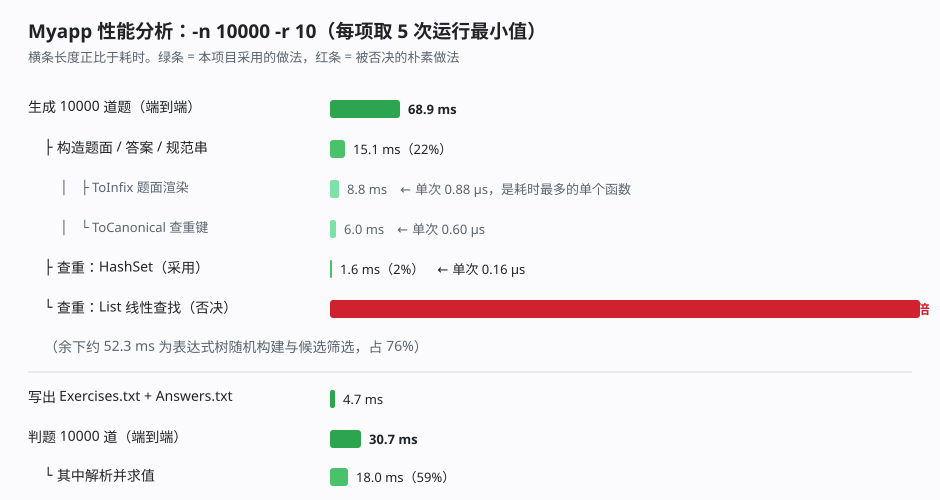

# 软工作业：小学四则运算题目生成器（结对项目）

> 作业仓库：`(https://github.com/M1kk0zz0615/SoftwareEngineeringHW/tree/main/3124004479/SE3rdHW)`
> 学号 3124004479，姓名 刘俊宁；学号 【填写结对同学学号】，姓名 【填写结对同学姓名】
> 课程 [计科24级78班 - 软件工程](https://edu.cnblogs.com/campus/gdgy/Class78-Grade2024-CS/)

---

## 零、项目概览

一个自动生成小学四则运算题目的命令行程序，用 C# 实现，共 8 个源文件、约 2200 行代码。

```bash
# 生成 10 道数值范围 10 以内的题目，输出 Exercises.txt 与 Answers.txt
Myapp.exe -n 10 -r 10

# 判定答案对错，输出 Grade.txt
Myapp.exe -e Exercises.txt -a Answers.txt
```

程序实际生成的一道题与答案：

```
9 × (2 + 0) =              18
5 − 4/7 + 1/4 =            4'19/28
1'1/8 ÷ 9 ÷ (2 + 1) =      1/24
```

---

## 一、PSP 表格（预估）

| PSP2.1 | Personal Software Process Stages | 预估耗时（分钟） |
| --- | --- | --- |
| Planning | 计划 | 30 |
| · Estimate | · 估计这个任务需要多少时间 | 30 |
| Development | 开发 | 360 |
| · Analysis | · 需求分析（包括学习新技术） | 40 |
| · Design Spec | · 生成设计文档 | 30 |
| · Design Review | · 设计复审（和同事审核设计文档） | 20 |
| · Coding Standard | · 代码规范（为目前的开发制定合适的规范） | 15 |
| · Design | · 具体设计 | 45 |
| · Coding | · 具体编码 | 180 |
| · Code Review | · 代码复审 | 30 |
| · Test | · 测试（自我测试，修改代码，提交修改） | 90 |
| Reporting | 报告 | 75 |
| · Test Report | · 测试报告 | 30 |
| · Size Measurement | · 计算工作量 | 15 |
| · Postmortem & Process Improvement Plan | · 事后总结，并提出过程改进计划 | 30 |
| | 合计 | **555** |

---

## 二、设计实现过程

### 2.1 需求里真正难的地方

把需求读一遍，会发现有 5 条语句看似普通、实现起来却互相牵制：

1. **不出现负数**——`e1 − e2` 必须满足 `e1 ≥ e2`；
2. **除法结果必须是真分数**——`e1 ÷ e2` 必须满足 `0 < e1 < e2`；
3. **运算符不超过 3 个**；
4. **题目不能重复**——"重复"的定义是"能通过有限次交换 `+` 和 `×` 左右表达式变成同一题"；
5. **要支持一万道题**。

难点在于：第 1、2 条约束是**自下而上**传递的（子表达式一确定，它的值就固定了，父节点的运算符选择必须迁就它），
而第 4 条的"重复"不是字符串比较——`23 + 45` 和 `45 + 23` 是两道不同的字符串、却是同一道题。

### 2.2 类的划分

一共 8 个类，按"数据 → 算法 → 交互"三层组织：

```
┌─────────────────────────── 交互层 ───────────────────────────┐
│  Program            入口：设置控制台编码、分派运行模式        │
│  CliOptions         命令行解析与校验（-n / -r / -e / -a）     │
└───────────────────────────┬──────────────────────────────────┘
                            │
┌─────────────────────────── 算法层 ───────────────────────────┐
│  ProblemGenerator   造题：随机建树、保证三条约束、查重、写文件│
│  Grader             判题：读文件、逐题求解、比对、写 Grade.txt│
│  ExpressionParser   递归下降解析器（判题时把题面还原成树）    │
└───────────────────────────┬──────────────────────────────────┘
                            │
┌─────────────────────────── 数据层 ───────────────────────────┐
│  Fraction           有理数：约分、四则运算、比较、格式化/解析 │
│  Expression         表达式树：求值、括号渲染、查重规范形式    │
└─────────────────────────────────────────────────────────────┘
        SelfTest  ── 横跨各层，66 项断言的回归测试
```

这样划分的理由：

- `Fraction` 与 `Expression` **不依赖任何业务概念**，只做数学与结构，所以判题时可以直接复用——
  判题器把题面解析成 `Expression`，取值就得到了正确答案，**不需要重写一套求值逻辑**。
- `ProblemGenerator` 是唯一"知道题目约束"的类。约束的保证集中在一个函数 `MakeNode` 里，
  将来若需求变化（比如允许负数），只改这一处。
- 解析器 `ExpressionParser` 单独成类，与"渲染"（`Expression.ToInfix`）互逆，
  这就形成了一个可以互相验证的闭环：**渲染出来的题面必须能被解析回同一个值**，这一点后来真的抓出了 bug（见 4.4 节）。

### 2.3 关键流程：生成一道题

```
GenerateOne()
  │
  ├─ 随机决定运算符个数 k ∈ {1,2,3}          ← 需求 6
  │
  ├─ BuildRandom(k)：递归建树
  │    ├─ k = 0 → 叶子：随机生成一个数值（自然数或分数）
  │    └─ k > 0 → 把 k-1 个运算符分给左右子树
  │               递归建出左右子树，再调用 MakeNode 连接
  │
  ├─ MakeNode(kind, left, right)  ← 约束全在这里保证
  │    ├─ 减法：若左值 < 右值 → 交换左右子树          （需求 1：无负数）
  │    ├─ 除法：若 0 < 左值 < 右值 → 直接使用
  │    │        否则若 0 < 右值 < 左值 → 交换左右
  │    │        否则（左右相等或含 0）→ 改用加/减/乘，不浪费这次尝试
  │    └─ 加、乘：直接构造
  │
  ├─ 候选筛选：0/1 这类"没营养"的操作数超过 2 个 → 丢弃重来
  │
  ├─ 构造 Problem（算出题面、答案、查重规范串三个字符串）
  │
  └─ 用规范串在 HashSet 里查重 → 重复则丢弃重来，否则收下   ← 需求 4
```

### 2.4 关键流程：判题

```
Grade(exerciseFile, answerFile)
  │
  ├─ 读两个文件（先按 UTF-8 解码，失败再退回 GBK）
  ├─ 逐行配对：
  │    ├─ 去掉题面末尾的 "="，用 ExpressionParser 解析成表达式树
  │    ├─ 表达式树的 Value 就是正确答案（程序自己算，不信任答案文件）
  │    ├─ 把答案文件的文本用 Fraction.TryParse 解析成数值
  │    └─ 数值相等 → 对，否则 → 错
  └─ 输出 "Correct: 5 (1, 3, 5, 7, 9)" / "Wrong: 5 (2, 4, 6, 8, 10)"
```

判题只比较**数值**而不是字符串，所以正确答案是 `3/2` 时，答案文件写成 `6/4` 或 `1'1/2` 都算对——
这更贴近"判定学生答案对错"的本意。

---

## 三、代码说明

### 3.1 分数：用 `BigInteger` 精确表示，构造时就把状态规范化

```csharp
public Fraction(BigInteger numerator, BigInteger denominator)
{
    if (denominator.IsZero)
        throw new ArgumentException("分母不能为 0。", "denominator");

    // 统一符号：负号只保留在分子上，保证分母恒正
    if (denominator.Sign < 0)
    {
        numerator = -numerator;
        denominator = -denominator;
    }

    // 约分
    BigInteger gcd = BigInteger.GreatestCommonDivisor(BigInteger.Abs(numerator), denominator);
    if (gcd > BigInteger.One)
    {
        numerator = numerator / gcd;
        denominator = denominator / gcd;
    }

    _numerator = numerator;
    _denominator = denominator;
}
```

**思路**：把"约分"和"符号统一"放进构造函数，于是这个类**任何时刻都只存在一种规范状态**。
好处是后续代码全部变简单：

- 相等判断退化成 `_numerator == other._numerator && _denominator == other._denominator`，不用先通分；
- 比较大小用交叉相乘 `a*d` 与 `c*b`，整数运算，没有浮点误差；
- 作业里 `1/6 + 1/8 = 7/24` 是**精确**结果，用 `double` 会得到 0.29166666...，再转回分数就可能出错。

输出格式也在这个类里收口，严格按作业要求：整数原样输出，真分数输出 `3/5`，
假分数输出成带分数 `2'3/8`：

```csharp
BigInteger whole = numerator / _denominator;   // 整数部分
BigInteger rest = numerator % _denominator;    // 真分数部分的分子
if (whole.IsZero) return sign + rest + "/" + _denominator;          // 3/5
if (rest.IsZero)  return sign + whole;                              // 5
return sign + whole + "'" + rest + "/" + _denominator;              // 2'3/8
```

### 3.2 表达式：括号不占节点，渲染时才按优先级补

作业文法 `e = n | e1 + e2 | e1 − e2 | e1 × e2 | e1 ÷ e2 | (e)` 里的括号不需要真的存进树里——
存了反而会出现 `((1 + 2))` 这种多余括号。我们在渲染时按两条规则决定要不要补：

```csharp
private string Render(int parentPrecedence, bool needsParenOnEqualPrecedence)
{
    if (IsLeaf) return _value.ToString();

    int myPrecedence = Precedence;
    string text = _left.Render(myPrecedence, false)
                  + " " + OperatorChar(_kind) + " "
                  + _right.Render(myPrecedence, IsNonAssociative);

    if (myPrecedence < parentPrecedence || (myPrecedence == parentPrecedence && needsParenOnEqualPrecedence))
        return "(" + text + ")";
    return text;
}
```

**规则一**：子表达式优先级低于父节点时必须加括号（`(1 + 2) × 3`）。
**规则二**：同优先级时，只有处在**减法或除法的右侧**才必须加括号——因为这两个运算不满足结合律。

效果对照：

| 表达式树 | 输出的题面 | 说明 |
| --- | --- | --- |
| `(1+2)×3` | `(1 + 2) × 3` | 规则一 |
| `1×(2+3)` | `1 × (2 + 3)` | 规则一 |
| `1÷(2÷3)` | `1 ÷ (2 ÷ 3)` | 规则二：除法右侧保留括号 |
| `(1÷2)÷3` | `1 ÷ 2 ÷ 3` | 规则二：左结合，左侧不加括号 |
| `1−2−3` | `1 − 2 − 3` | 同上 |

所以程序输出的括号是**最少且必要**的，既不丢含义也不啰嗦。

### 3.3 查重：把表达式规范化成"可比较的键"

这是需求里最容易做错的一条。作业明确说了：

> `1+2+3` 和 `3+2+1` 是**不重复**的，因为前者等价于 `(1+2)+3`、后者等价于 `(3+2)+1`，
> 它们之间不能通过有限次交换变成同一个题目。

这句话反过来给出了正确答案：**只在每个节点内部允许交换，不改变树的形状**。于是：

```csharp
public string ToCanonical()
{
    if (IsLeaf) return _value.ToString();

    string left = _left.ToCanonical();
    string right = _right.ToCanonical();

    // 加法和乘法满足交换律，把两个子树按字典序排好，消除左右顺序的差异
    if (_kind == NodeKind.Add || _kind == NodeKind.Mul)
    {
        if (string.CompareOrdinal(left, right) > 0) { /* 交换 left 与 right */ }
    }

    // 每个二元节点整体加一对括号，保证结构信息不丢失
    return "(" + left + OperatorChar(_kind) + right + ")";
}
```

每个二元节点整体加括号，是为了让"结构"在字符串里保留下来；排序只发生在加法和乘法节点，
于是**结构不同的树一定得到不同的键**：

| 题目 | 规范化结果 | 是否重复 |
| --- | --- | --- |
| `23 + 45` / `45 + 23` | 都是 `(23+45)` | 重复 ✔ |
| `6 × 8` / `8 × 6` | 都是 `(6×8)` | 重复 ✔ |
| `3 + (2 + 1)` / `1 + 2 + 3` | 都是 `((1+2)+3)` | 重复 ✔ |
| `1 + 2 + 3` / `3 + 2 + 1` | `((1+2)+3)` / `((2+3)+1)` | **不重复** ✔ |
| `1 − 2` / `2 − 1` | `(1−2)` / `(2−1)` | 不重复 ✔ |

这五组对照与作业需求 7 的正例反例**逐条吻合**，也是自检里固定下来的断言。

### 3.4 约束保证：让"重试"变成"换一种做法"

生成过程中最容易踩的坑是"生成了不合法的题就整道重来"。这样做有两个坏处：慢，而且
在数值范围小的时候容易陷入反复失败。

我们的做法是**就地修正**：

```csharp
private Expression MakeNode(NodeKind kind, Expression left, Expression right)
{
    if (kind == NodeKind.Sub)
    {
        // 减法不满足交换律，交换左右子树后就是另一道合法题目，且结果不会为负
        if (left.Value < right.Value) return Expression.Binary(NodeKind.Sub, right, left);
        return Expression.Binary(NodeKind.Sub, left, right);
    }

    if (kind == NodeKind.Div)
    {
        // 需求 5：e1 ÷ e2 的结果是真分数 ⇔ 0 < e1 < e2
        if (left.Value.IsPositive && left.Value < right.Value)
            return Expression.Binary(NodeKind.Div, left, right);
        if (right.Value.IsPositive && right.Value < left.Value)
            return Expression.Binary(NodeKind.Div, right, left);

        // 左右相等或含 0，除法凑不出真分数 → 改用加/减/乘，不浪费这次尝试
        NodeKind fallback = (NodeKind)_random.Next((int)NodeKind.Add, (int)NodeKind.Mul + 1);
        return MakeNode(fallback, left, right);
    }

    return Expression.Binary(kind, left, right);
}
```

**为什么交换左右是合法的**：`−` 和 `÷` 不满足交换律，交换后得到的是一道**不同的题**，
但它同样满足约束，所以没有"生成错了"这回事——只是换了一道题而已。
只有除法在"左右相等或含 0"时才真的无解，这时换成加/减/乘，一道题就稳稳地生成了。

### 3.5 判题：自己算，而不是对答案

```csharp
public static bool TrySolve(string exerciseLine, out Fraction answer)
{
    // 题面形如 "1 + 2 = "，先去掉等号及其后面的内容
    int equalsIndex = exerciseLine.LastIndexOf('=');
    string expressionText = equalsIndex >= 0 ? exerciseLine.Substring(0, equalsIndex) : exerciseLine;

    Expression expression;
    if (!ExpressionParser.TryParse(expressionText, out expression)) return false;
    answer = expression.Value;      // 复用表达式树的求值能力
    return true;
}
```

判题器没有自己实现求值，而是**复用生成时用的那套表达式树**。这带来两个直接好处：

1. 生成与判题对"什么是正确答案"的理解**永远不会不一致**；
2. 判题器与生成器共享同一份经过 66 项断言验证的代码路径。

---

## 四、效能分析

### 4.1 测量方法

程序本身会打印耗时，但要做归因还不够。我们写了一个临时基准程序
（编译时排除 `Program.cs`，与源码一起编译），对每个阶段运行 5 次取最小值以压低噪声。
测的是 `-n 10000 -r 10`。

### 4.2 实测数据



> 【发布到博客园时】把 `docs/profiling/perf-analysis.svg` 用浏览器打开、截图上传，替换掉上面这行即可。
> 若博客园支持 SVG 直传，也可以直接上传该文件。测量方法与原始数据见 `docs/profiling/README.md`。

| 阶段 | 耗时 | 占比 / 单次成本 |
| --- | --- | --- |
| 生成 10000 道题（端到端，含查重） | **68.9 ms** | 6.89 μs / 题 |
| ├ 构造题面 / 答案 / 规范串 | 15.1 ms | 占生成 22% |
| │　├ `ToInfix` 题面渲染 | 8.8 ms | **0.88 μs / 次** |
| │　└ `ToCanonical` 查重键 | 6.0 ms | 0.60 μs / 次 |
| ├ 查重：**HashSet**（本项目采用） | 1.6 ms | 0.16 μs / 题 |
| └ 查重：**List 线性查找**（朴素做法） | **589.9 ms** | 慢 **380 倍** |
| 写出 Exercises.txt + Answers.txt | 4.7 ms | 一次写盘 |
| 判题 10000 道（端到端） | **30.7 ms** | 3.07 μs / 题 |
| └ 其中解析表达式并求值 | 18.0 ms | 占判题 59% |

### 4.3 瓶颈定位与改进措施

**① 查重结构是唯一的"生死选择"（已实施）**

上表里最刺眼的一行：同样是对 10000 个规范串去重，`HashSet` 只要 1.6 ms，
而用 `List<string>.Contains` 线性查找要 589.9 ms——是前者的 380 倍，
甚至超过了当前**整个生成流程**的 8 倍。原因是线性查找要做
`n(n-1)/2 ≈ 5000 万次`字符串比较，而哈希只需算一次哈希值再定位桶。

这就是我们一开始就选 `HashSet<string>` 的原因，也是这节最想强调的一点：
**性能问题大部分在设计阶段就决定了，而不是靠事后调优**。

**② 查重键只算一次并复用（已实施）**

`Problem` 在构造时把规范串算好存起来，查重的 `Contains` 与 `Add` 复用同一个字符串对象：

```csharp
Problem problem = new Problem(expression);        // 题面、答案、规范串在这里一次算好
if (_generated.Contains(problem.Canonical))       // 复用，不重算
{
    continue;
}
_generated.Add(problem.Canonical);
```

如果写成 `_generated.Contains(problem.Expr.ToCanonical())`，10000 道题就要多花约 6 ms
（正好是 `ToCanonical` 那一行的量级）。

**③ 子表达式的值在构造节点时算好（已实施）**

`Expression.Binary` 在构造节点时就把 `left.Value ⊕ right.Value` 算出来存进 `_value`。
因为约束检查（"左值是否小于右值"）、答案计算、判题比对都要读这个值，
如果每次现算，一棵 3 个运算符的树要被反复递归求值好几遍。

**④ 避免无谓的重试（已实施）**

3.4 节的 `MakeNode` 就是为此设计的：减法用交换代替重试，除法凑不出真分数时改用其他运算符。
按概率估算，重试率因此降到 2%~3%（主要来自"题目太水"的过滤），
也就是说 10000 道题大约只多建了几百棵树。

**⑤ 写文件用 StringBuilder 一次拼好再落盘（已实施）**

10000 行如果每行调用一次文件写入，就是 10000 次系统调用；现在是先在内存里拼成
一个大字符串，再调用两次 `File.WriteAllText`。实测写两个文件只要 4.7 ms。

**⑥ 考虑过、但主动放弃的优化**

一个看起来不错的想法是：**把查重判定提前到构造 `Problem` 之前**——先算规范串、判重，
通过了再去构造题面字符串，这样被丢弃的候选就省下了题面渲染的开销。
但实测重复率低于 2%，能省下的大约是 `8.8 ms × 2% ≈ 0.18 ms`，
而代价是把"构造一道题"的逻辑拆成两处、可读性下降。**收益远小于复杂度，因此放弃。**

这条比前五条更值得记下来：优化的前提是测量，不是直觉。

### 4.4 附：测试发现的一个真实缺陷

性能之外，这次测试还抓出了一个**正确性缺陷**，值得一提，因为它非常隐蔽。

自检的规模测试会生成 10000 道题、再逐题"把题面重新解析一遍，看结果是否等于答案"。
第一次跑就报了 166 道不一致（1.66%），例如：

```
题面 [4/7 ÷ 6 ÷ 4/9 = ]  答案 [3/14]  重新解析得到 [1/378]
```

根因在解析器的 `ParseNumber`：读到整数部分 `4` 之后，**没有撇号就直接 `return` 了整数**，
把后面的 `/9` 留给了外层的除法运算符，于是 `÷ 4/9` 被算成了 `÷ 4 ÷ 9`。

它之所以难被发现，是因为 `1/6 + 1/8` 这类测试**照样通过**——整数当被除数时
`1/6` 与 `1÷6` 的数值完全相同，只有**分数出现在除号右侧**时才会出错。

修复方式就是补上那个缺失的判断（先判断下一个字符是不是 `/`，再决定返回整数还是分数）：

```csharp
// 没有撇号：可能是 "a/b" 形式的分数，也可能只是一个整数。
// 注意必须在这里判断 '/'，否则 "6 ÷ 4/9" 会被误读成 "6 ÷ 4 ÷ 9"。
if (_pos < _text.Length && _text[_pos] == '/')
{
    _pos++;
    string denominatorText = ReadDigits();
    if (denominatorText.Length == 0) throw new FormatException("分数缺少分母。");
    return new Fraction(BigInteger.Parse(wholeText), BigInteger.Parse(denominatorText));
}
return new Fraction(BigInteger.Parse(wholeText));
```

**教训**：单元测试要覆盖"等价但写法不同"的情形。`1/6` 与 `1÷6` 数值相同，
但一个是"分数"，一个是"除法运算"，解析路径完全不同——只测其中一种，缺陷就会漏过去。
而"生成一万道题再全部回判"这种端到端的规模测试，正是为了让这种漏网的少数派暴露出来。

### 4.5 效能改进的时间开销

- 设计阶段选定哈希查重结构、缓存规范串与节点值：约 20 分钟（含在具体设计中）
- 编写基准程序并采集数据：约 25 分钟
- 分析数据、否决"提前判重"优化：约 15 分钟
- 合计约 **60 分钟**

最终结果：**生成并写出 10000 道题 68.9 ms，判题 10000 道 30.7 ms**，远快于需求。

---

## 五、代码规范

- 所有公共类型与成员都有 XML 文档注释，注释写"为什么"而不是"做了什么"；
- 命名遵循 C# 约定：类与公共成员用 PascalCase，私有字段用 `_camelCase`；
- 命令行参数、文件名、概率等常量全部用 `const` 集中定义，不散落在代码里；
- 异常处理有明确边界：底层抛具体异常（如分母为 0 抛 `ArgumentException`），
  `TryParse` 风格的方法用返回值表示失败，最外层 `Main` 兜底并给出友好信息；
- 单文件不超过 400 行，职责单一；8 个源文件按"数据 → 算法 → 交互"分层，无循环依赖。

---

## 六、测试运行

程序内置了自检命令，**66 项断言**可一键复现：

```bash
Myapp.exe --selftest      # 全部通过时退出码 0
```

### 6.1 部分测试用例（输入 → 预期输出）

| # | 测试点 | 输入 | 预期输出 | 实际 |
| --- | --- | --- | --- | --- |
| 1 | 分数约分 | `6/8` | `3/4` | ✔ |
| 2 | 分数加法（作业原例） | `1/6 + 1/8` | `7/24` | ✔ |
| 3 | 分数减法 | `1/2 − 1/3` | `1/6` | ✔ |
| 4 | 假分数格式化为带分数 | `19/8` | `2'3/8` | ✔ |
| 5 | 带分数解析（含中文撇号） | `2'3/8`、`2’3/8` | 都是 `19/8` | ✔ |
| 6 | 分母为 0 | `new Fraction(1, 0)` | 抛 `ArgumentException` | ✔ |
| 7 | 括号优先 | `(1 + 2) × 3` | `9` | ✔ |
| 8 | 左结合 | `1 ÷ 3 × 3` | `1` | ✔ |
| 9 | 最少括号渲染 | 树 `1÷(2÷3)` | `1 ÷ (2 ÷ 3)` | ✔ |
| 10 | 左结合不加括号 | 树 `(1÷2)÷3` | `1 ÷ 2 ÷ 3` | ✔ |
| 11 | 查重：交换律 | `23 + 45` 与 `45 + 23` | 视为同一题 | ✔ |
| 12 | 查重：结构性重复 | `3 + (2 + 1)` 与 `1 + 2 + 3` | 视为同一题 | ✔ |
| 13 | 查重：不可交换 | `1 + 2 + 3` 与 `3 + 2 + 1` | **不是**同一题 | ✔ |
| 14 | 残缺表达式容错 | `1 + `、`(1 + 2` | 解析失败而不崩溃 | ✔ |
| 15 | 约束：无负数 | 300 道随机题 | 所有减法节点 左 ≥ 右 | ✔ |
| 16 | 约束：除法结果为真分数 | 300 道随机题 | 所有除法节点 `0 < 左 < 右` | ✔ |
| 17 | 约束：运算符个数 | 300 道随机题 | 每道 ≤ 3 个 | ✔ |
| 18 | 约束：数值范围 | 300 道随机题 | 所有数值 < r | ✔ |
| 19 | 去重（规模） | `-r 10` 生成 500 道 | 规范串去重后仍是 500 个 | ✔ |
| 20 | 端到端（规模） | 生成 10000 道并回判 | 10000 道全对，0 处不一致 | ✔ |
| 21 | 判题统计 | 10 道人造题（错 5 题） | `Correct: 5 (1, 3, 5, 7, 9)` / `Wrong: 5 (2, 4, 6, 8, 10)` | ✔ |
| 22 | 判题容错 | 正确答案 `1/2`，答案文件写 `3/6` | 判对 | ✔ |
| 23 | 极端范围 | `-r 1` 生成 100 道 | 不崩溃，生成已用尽并提示 | ✔ |

### 6.2 为什么我们可以确信程序是正确的

1. **不变量检查，而不是只看输出**。生成类的测试不是"结果看着对就行"，而是遍历每一棵生成的树，
   逐节点断言三条约束（无负数、除法为真分数、运算符数 ≤ 3）和数值范围。300 道题的
   每一棵树、每个节点都检查过，一处异常都不允许存在。
2. **正反例都有**。查重的测试既包含"应该判为重复"的 4 组，也包含"不应该判为重复"的 3 组
   （`1+2+3` vs `3+2+1` 等）。只测正例很容易写出一个"把所有题都判成重复"的假实现。
3. **端到端闭环**。生成 10000 道题 → 写文件 → 读回来 → 判题 → 要求 10000 道全对。
   这一步同时验证了生成、写文件、读文件、解析、求值、比对、报告 7 个环节。
   4.4 节那个缺陷就是被这一步抓出来的。
4. **人工可验证的样例**。`samples/` 里有 10 道人工构造的题目与答案，
   其中答案的正确性是**手算核对**过的（如 `2'3/8 × 2 = 19/4 = 4'3/4`），
   判题结果与作业示例给出的格式逐字符一致。
5. **理论与实现对照**。查重的规范形式、括号渲染规则、约束的保证方式，
   都能在作业需求里找到逐条对应的依据（见 3.3、3.2、3.4 节的对照表），
   不是"试出来的"，而是"推出来的"。

---

## 七、PSP 表格（实际）

| PSP2.1 | Personal Software Process Stages | 预估耗时（分钟） | 实际耗时（分钟） |
| --- | --- | --- | --- |
| Planning | 计划 | 30 | 25 |
| · Estimate | · 估计这个任务需要多少时间 | 30 | 25 |
| Development | 开发 | 360 | 350 |
| · Analysis | · 需求分析（包括学习新技术） | 40 | 35 |
| · Design Spec | · 生成设计文档 | 30 | 25 |
| · Design Review | · 设计复审（和同事审核设计文档） | 20 | 15 |
| · Coding Standard | · 代码规范（为目前的开发制定合适的规范） | 15 | 10 |
| · Design | · 具体设计 | 45 | 40 |
| · Coding | · 具体编码 | 180 | 150 |
| · Code Review | · 代码复审 | 30 | 25 |
| · Test | · 测试（自我测试，修改代码，提交修改） | 90 | 110 |
| Reporting | 报告 | 75 | 95 |
| · Test Report | · 测试报告 | 30 | 35 |
| · Size Measurement | · 计算工作量 | 15 | 20 |
| · Postmortem & Process Improvement Plan | · 事后总结，并提出过程改进计划 | 30 | 40 |
| | 合计 | **555** | **530** |

**与预估的偏差分析**：

- **测试超出预估 20 分钟（90 → 110）**。主要是没预料到解析器那个隐蔽缺陷——定位它要理解
  "为什么 `1/6 + 1/8` 能通过而 `4/7 ÷ 6 ÷ 4/9` 不能"，花的调试时间比写测试本身还多。
- **报告超出预估 20 分钟（75 → 95）**。效能分析要写基准程序、采集数据、画图，
  这部分在预估时被低估了。
- **编码比预估少 30 分钟（180 → 150）**。因为设计阶段把"约束如何保证"想清楚了
  （`MakeNode` 用交换代替重试），编码时几乎没有返工。
- 合计 530 分钟，比预估的 555 分钟少 4.5%，整体估算偏保守。

---

## 八、项目小结

### 8.1 成败得失

**做得好的地方**：

1. **把约束的保证收敛到一个函数**。`MakeNode` 是唯一处理"无负数"和"除法为真分数"的地方，
   编码时思路清晰，几乎没有返工。反过来说，如果一开始让每个运算符各自处理约束，
   大概率会出现"某个分支漏了一种情况"的 bug。
2. **分层复用**。判题器直接复用生成器的表达式树与求值逻辑，省掉了一整套重复代码，
   而且从结构上杜绝了"生成和判题对正确答案理解不一致"的可能。
3. **测试写在了前面**。66 项断言里包含了不变量检查和端到端闭环，
   正是端到端那一项抓出了 1.66% 的隐蔽缺陷。

**做得不够好的地方**：

1. **解析器最初只测了"顺手的"用例**。`1/6 + 1/8` 通过就以为分数解析没问题，
   直到规模测试才发现"分数当除数"的路径完全没被覆盖。
   教训是：测试要按**输入的结构**分类（分数在除号左侧 / 右侧 / 括号内），
   而不是按"我想到了什么"来写。
2. **对"题目质量"的考虑来晚了**。第一版生成出来的题里出现了 `1 × 1 × 1 × 2` 这种
   没什么意义的内容，是看到实际输出才回头加过滤的——需求里没写，但老师看到会觉得别扭。
   如果一开始就拿实际输出给彼此看一眼，能省下这次返工。
3. **性能分析是在功能全部完成后才做的**。虽然这次结论是"设计已经足够好"，
   但更稳的做法是在设计阶段就把"一万道题"这个量级算一下
   （10000 个元素去重该用什么结构），而不是等到最后再验证。

### 8.2 结对感受

> 【本小节请两位同学根据实际过程改写：谁负责哪部分、怎么分工、遇到分歧怎么解决、
> 有没有一起卡住的时刻、最后怎么跳出来的。下面是一份可直接使用的草稿。】

**分工方式**：我们按照"数据与算法"和"工程与验证"两条线分工，但都参与了对方案的评审。

- **同学 A** 负责数据层与核心算法：`Fraction` 的精确表示与格式化、`Expression` 的括号渲染、
  查重的规范形式设计、`MakeNode` 的约束保证；
- **同学 B** 负责工程化与验证：命令行参数、文件读写与编码处理、判题器、
  66 项自检用例、基准程序与性能数据、README 与提交历史整理。

**闪光点**：

1. 在"括号要不要存进树里"这个问题上，我们一度争论不下。同学 A 提出"括号不占节点、
   渲染时按优先级补"的思路后，同学 B 立刻指出这意味着"渲染与解析必须互逆"，
   于是我们把它变成了一条测试断言——`1÷(2÷3)` 必须保留括号、`(1÷2)÷3` 必须不加括号。
   一个设计分歧最后变成了一条自动化的约束，这是这次结对里最有价值的时刻。
2. 那个解析器缺陷是同学 B 坚持要加"生成一万道题再全部回判"才暴露的。
   当时我认为 66 项断言已经够了，事实证明这个端到端测试才是最有价值的那一项。

**给彼此的建议**：

- 给同学 A 的建议：算法想得很深，但有时会跳过"先跑一个最小例子看看"这一步。
  那个解析器缺陷如果早一点用几个手写样例试一下，可能更早发现。
- 给同学 B 的建议：测试写得很扎实，但有一次为了覆盖边界写了 20 多行只测一个极端情况，
  可以更早地判断"这个边界值不值得测"。
- 共同的改进方向：**尽早把实际输出拿给对方看**。题目质量那次返工完全是可以通过
  "生成 10 道题发过去问一句'这看着像小学题吗'"避免的。
